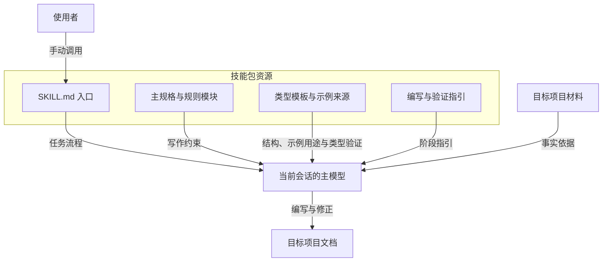
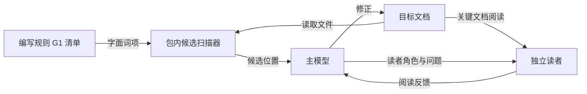

# 架构与文档优化方法

## 1. 主题：规则和模板如何参与写作

doc-writing 是由入口、写作规则、类型模板和候选扫描器组成的技能包。主模型读取这些资源及目标项目材料，完成文档编写与检查。本文解释各部分的职责、资料读取方式和文档优化流程；实际调用见[使用指南](usage.md)，新增模板见[模板扩展](templates.md)。

它的组织方式是**模型负责理解与判断，文件提供规则与结构，脚本返回可定位的文本候选**。例如，操作指南是否缺少必要前提，需要结合读者任务判断；某行是否出现指定词项，则可以直接扫描。两种检查因此保留不同的职责。

## 2. 核心概念：三类输入，一个写作主体

### 2.1 规则、模板与项目事实

三类输入分别回答不同的问题，写作时共同作用于同一份文档。

| 输入 | 回答的问题 | 主要来源 | 对正文的作用 |
|---|---|---|---|
| 写作规则 | 怎样组织、表达和检查信息？ | `docs/modules/constraints-common.md`、`constraints-writing.md`、`constraints-architecture.md`；`docs/design-spec.md` 是设计索引 | 要求结论先行、证据可辨、术语一致，并规定检查方法 |
| 类型模板 | 这类文档必须回答什么？ | `templates/_index.md` 和对应类型文件 | 确定类型、变体、锚定节、可插模块及类型验证 |
| 项目事实 | 这个项目实际是什么、做了什么？ | 用户材料、代码、配置、项目历史和运行记录 | 提供接口、行为、约束、已有决策与测试结果 |

锚定节是定义文档职责的必需内容。例如，How-to 操作指南保留目标、前置条件和步骤；Reference 参考文档保留所描述对象的名称、类型、默认值及其他契约字段。模板决定这些内容如何组织，具体值仍来自目标项目。

**规则保持一个来源，实例保持自己的事实来源。** 扫描器从编写规则的 G1 原文读取词项，编写和检查指引链接到约束模块；示例只展示登记过的写法。修改规则时有明确入口，写项目文档时也能区分通用要求和当前项目的数据。

### 2.2 模型主检与候选扫描

模型主检处理需要上下文的问题，包括主题是否偏移、理由是否支持结论、操作是否具备前提、术语含义是否一致。`runtime/doc-lint.py` 从编写规则模块的 G1 禁用模式清单提取字面词项，输出文件、行号、类别和命中文本，供模型回到原文裁决。

以正文中的“高效”为例：扫描器能够找到这个词；模型还要查看它是否有对应度量、度量是否有来源，以及该词是否有必要保留。由脚本直接改写，会跳过这些与原意有关的判断。因此，候选的处理结果由模型确定：修正、按上下文保留，或提出需要确认的信息。

这种分工也确定了各自的执行范围：

- **扫描器**：采用单个 Python 标准库脚本，便于直接调用；只读取输入文件并返回候选。
- **主模型**：结合用户任务、模板和项目证据作出质量判断，并在写作任务中修改正文。

## 3. 关联：组件、依赖与结果归属

### 3.1 结构关系

下图展示写作主体及其依赖。箭头表示请求、资料或结果的流向；包内文件提供指引，由当前会话的主模型执行。

验证关系单独展开，避免将包内资源依赖和修正反馈挤在同一张图中：

候选扫描器由主模型调用，独立读者按文档需要启动。扫描器读取包内 G1 清单和已保存文档；读者获得文档、角色及问题，提供另一种反馈。

主模型掌握本次任务的工作上下文；生成文档保存在用户指定的目标项目路径。技能包保存通用资源，扫描器返回扫描结果，独立读者返回阅读反馈。这里的独立读者是按需启动、未参与写作讨论的另一个模型会话。

### 3.2 文件职责与读取时机

下表中的路径均相对于技能包根目录。

| 文件或目录 | 职责 | 读取时机 |
|---|---|---|
| `SKILL.md` | 手动入口、准备到交付的执行顺序、资源定位 | 使用者调用 skill 时 |
| `docs/modules/constraints-common.md` | C1–C6、全部子规则及 G2 | 调用后先读，先于取材与范围决定 |
| `runtime/prepare.md` | 组织准备与选型 | 准备与选型前 |
| `runtime/research.md` | 组织取材与证据路由 | 核对或获取任务材料前 |
| `runtime/write-assist.md` 与 `docs/modules/constraints-writing.md` | 组织编写阶段的规则查阅与表达选择；G1/G3 原文 | 首次文稿、实际骨架文字或建议前；提前输出则提前读 |
| `docs/modules/constraints-architecture.md` | 完整 D1 | 实际提出技术架构决策前，含详细设计中的架构选择 |
| `docs/modules/` | 约束原文、模板、表达、读取方式、验证和读者测试的详细规则 | 按阶段及所需功能读取 |
| `docs/design-spec.md` | 设计索引：设计原则、模块摘要与交叉引用 | 不每次作为前置；需要设计理由或优先级时按需查 |
| `templates/_index.md` | 将读者任务对应到文档类型 | 准备阶段匹配类型时 |
| `templates/{type}.md` | 变体选择、锚定节、模块和类型验证 | 类型确定后完整读取，含变体、条件、类型验证与适用分支 |
| `runtime/verify-checks.md` | 组织完整模型主检、原收尾责任及后续验证 | 初稿完成后和交付前，重新核对适用原文 |
| `runtime/doc-lint.py` | 读取 G1 词项并扫描文本候选 | 验证阶段，对已保存文档执行 |
| `examples/SOURCES.md` | 登记示例来源、用途与许可依据 | 使用示例前 |

入口中的 `${CLAUDE_SKILL_DIR}` 定位实际加载的技能包。用户文档路径则属于当前工作项目。二者分开定位，助手才能在不同项目中使用同一套规则，同时让文档引用当前项目的真实材料。

### 3.3 按阶段读取，而不是一次装入所有模板

完整通用约束在调用后先读，编写规则在首次文稿或实际骨架前补齐；类型模板按任务选择，表达与验证指引在对应阶段读取。这种按阶段组织资源的方式称为渐进式披露。

例如，编写端点参考需要 API 模板中的参数和错误码要求；编写项目架构说明需要 Explanation 模板中的机制解释与关联要求。按类型加载，可以让当前文档采用对应的结构和验证标准，而不必同时展开所有文档的变体。共同适用的真实性、范围和表达规则仍完整保留。

## 4. 从请求到交付的优化流程

优化同时作用于内容选择、结构、表达和验证，不只是替换词语。各阶段的产出为下一阶段提供依据；验证发现问题后，模型回到对应位置修正，再检查受影响的内容。

| 阶段 | 采用的方法 | 阶段产出 |
|---|---|---|
| 准备 | 根据用户任务确定主题、读者和依据版本，选择类型、变体与必要模块 | 范围和文档骨架 |
| 信息获取 | 优先读取本地证据，再核对历史、官方资料及必要的人类确认 | 有来源的事实和需要补充的信息 |
| 编写 | 先写核心结论与支撑，再校准摘要；逐节检查术语和表达 | 按读者任务组织的初稿 |
| 验证与修正 | 完整模型主检、类型验证、候选裁决、内容对齐、去重及适用的读者测试 | 修正后的终稿 |
| 交付 | 按约定输出正文或保存文件，另行说明实际检查结果 | 用户所需文档及简短交付说明 |

### 4.1 先固定任务，再用实现核实

主题由使用者的目标决定，实现用于核实主题下的事实。例如，用户请求一份项目快速开始，正文应帮助新使用者完成项目的主要任务；即使仓库里某个辅助脚本更容易演示，也不会据此替换选题。

资料按以下顺序获取：

- **本地代码与配置**：确认函数、接口、参数、默认值和依赖。
- **项目历史与上下文**：确认变更理由和已有决策。
- **官方资料**：补充外部协议或产品契约；独立的信息获取会话返回带来源的事实。
- **必要的人类确认**：解决材料中没有记载的业务目标或关键歧义。

事实与目标也分别处理。接口参考描述选定版本的实现；需求文档描述目标状态；测试报告采用对应运行记录。明确每段的依据，可以避免把未来要求写成当前功能，或把已有测试用例写成已经运行的结果。

### 4.2 用类型约束结构，用任务决定深度

类型确定文档职责，变体确定展开方式，模块补充当前任务需要的信息。三层选择让短文和长文共享质量要求，同时保留不同的结构深度。

例如，小范围需求可以采用 Brief，集中回答问题、目标与非目标、验收标准；涉及多个团队的需求则需要展开场景、功能、依赖和里程碑。深度来自读者需要作出的判断，而不是每章都写同样多的字。

结构优化遵循两个判断：

- **必需内容是否完整**：所选变体的锚定节、必需字段和固定格式保持齐全。
- **补充内容是否有用途**：模块回答范围内的具体问题；信息尚不完整时保留已知部分和所需补充，纯粹凑数的模块则移除。

### 4.3 按信息关系选择表达

正文先给章节要点，再补理由、事实和条件。不同关系采用不同表达形式，使读者能够区分动作、查询信息与论证。

| 信息关系 | 表达方式 | 使用例子 |
|---|---|---|
| 有先后依赖的动作 | 编号步骤，关键步骤附结果确认 | 安装、接入、迁移 |
| 并列职责或要求 | 分组条目 | 组件职责、输入材料 |
| 参数与约束的对应 | 字段表或定义列表 | 类型、默认值、必填项 |
| 多方案的同维度差异 | 比较表加必要论证 | 成本与一致性取舍 |
| 组件之间的依赖 | 结构关系图 | 模型、规则和扫描器的关系 |
| 前提到结论的推理 | 短段论证 | 为什么采用某种设计 |

表达修正保留作者有效的经验、立场和质疑，围绕准确性、可读性和任务完成来调整。删除重复铺垫与空泛修饰，并不意味着删除支撑判断的事实或必要条件。

### 4.4 把检查结果用于修正

验证先在同一次模型主检中核对通用规则和当前类型标准，再结合脚本候选、事实来源与读者反馈检查正文。相近的检查要求合并执行，具体责任仍按原规则保留。

修正范围由问题决定：

- **术语变更**：核对全文是否仍然一物一名。
- **数字或接口变更**：核对相关表格、示例与结论。
- **新增段落**：复查主题范围、来源和重复内容。
- **阅读障碍**：区分误解、费解、内容缺失和错误推断，修改引发问题的表述，再重测相关问题。

去重以阅读单元为依据。一条独立操作指南需要自己的前置条件，一个独立端点需要自己的鉴权说明；这些信息不会因为另一篇或另一节已经出现就被删去。同一阅读单元中没有新增用途的重复，则合并到最合适的位置。

Brief、备忘、PR Note、决策日志和 CI 报告采用快速路径：简化事实卡片等包装，省去独立读者测试和单独的缺口汇总；通用约束、类型验证及必要的证据核对仍然执行。

## 5. 进一步使用

- [使用指南](usage.md)：把写作目标转为调用请求，提供材料并修改已有文档。
- [模板扩展](templates.md)：选择类型、变体或模块作为扩展位置，并完成登记与试写。
- [完整写作规则](../modules/constraints-common.md)：查阅具体规则的条件、优先级与检查要求；编写规则见[constraints-writing.md](../modules/constraints-writing.md)，架构约束见[constraints-architecture.md](../modules/constraints-architecture.md)。
