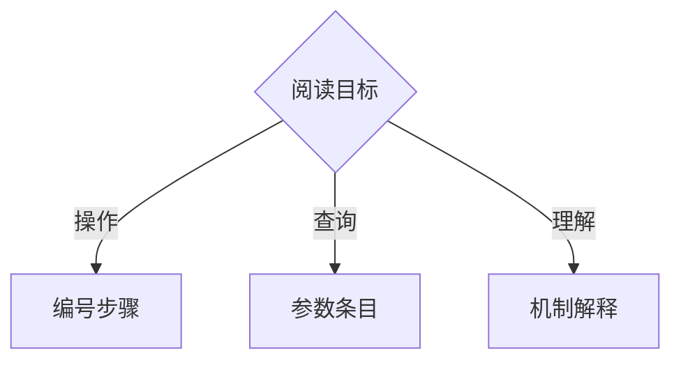
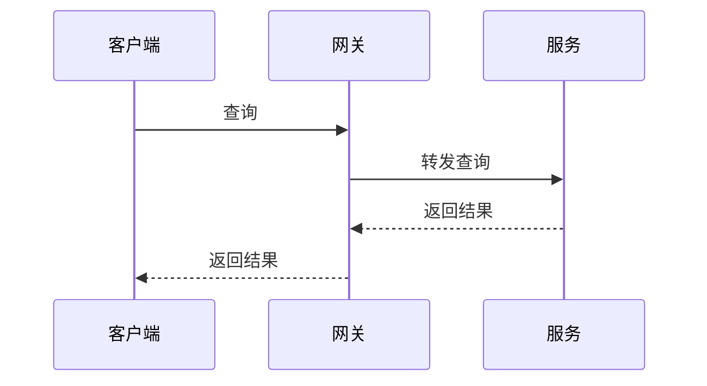

# Mermaid 图规范

涉及结构或流程关系，需要判断是否用图时完整读取；不能先自行决定不画图来绕过原有触发条件。

#### 5.8.2 Mermaid 图使用规范

**适用场景**（用图比用文字更清晰的场景）：

| 场景 | 推荐图类型 | 示例 |
|------|-----------|------|
| 场景交互 / 服务通信 | sequence diagram | 标明设计流程或实际记录，只画声明场景 |
| 系统架构总览 | block diagram / flowchart | 组件间的依赖和数据流向 |
| 状态机 / 生命周期 | state diagram | 订单状态从创建到完成的所有转换 |
| 决策流程 | flowchart | 请求路由的分支判断逻辑 |
| 数据库设计 | ER diagram | 表间关系和外键 |
| 部署时间线 | gantt | 分阶段上线计划 |

**图的约束**：

- 信息量按读者问题决定；关系拥挤或层次混杂时拆分，不按列表项数限制
- 标题对应本节问题；架构图展示所需组成、职责、边界与依赖，不能用目录树或步骤图替代；其他图按所选图种表达流程、交互、状态等关系
- 图中模型、工具、文件资源等按真实项目关系绘制，不套成不存在的服务系统；图文名称、方向一致，按需补图例与题注
- 文字补充依据、取舍或限制，不逐箭头复述
- 复杂系统按读者需要从总览展开细节

默认使用发布端支持的基础语法。`architecture-beta` 仅在用途合适且渲染器支持时使用；基础门槛 11.1.0 不代表支持全部后续功能。交付前实际渲染，核对关系、标签与可读性是否回答本节问题，不只查图存在；未能渲染则明确未验证。

**不适用场景**（用图反而更不清晰）：

- 纯线性步骤（用编号列表更直接）
- 只有两个组件的简单关系（一句话说清楚）
- 只为缩短论证而画图，却未展示流程、交互或结构关系

**构造示意**：只展示排版与基础语法；图未渲染。

动作链用编号；独立信息用无序项：

```markdown
1. 选择文档变体。
2. 按该变体生成骨架。

- 目标读者：项目新成员
- 材料版本：指定提交
```

流程图表达分支：



时序图表达一次设计场景：



文件树表示假设版本 v1 → v2 的 `src/` 净变化；`+` 新增、`-` 删除、`~` 修改、`R` 重命名，未变文件省略：

```text
src/
├── + config.py
├── ~ app.py
├── - legacy.py
└── R util.py → utils.py
```

`git diff-tree` 提供差异，不直接生成文件树。拟议树写明基线和计划状态，实际差异注明提交；未知路径标为拟定。关联载体的构造示意见[实现示意](../../examples/tech-design/implementation-sketch.md)，仅需该表达时读取。

## 关联入口

- [编写入口](../../runtime/write-assist.md)
- [表达资源索引](5.8-structured-expression.md)
