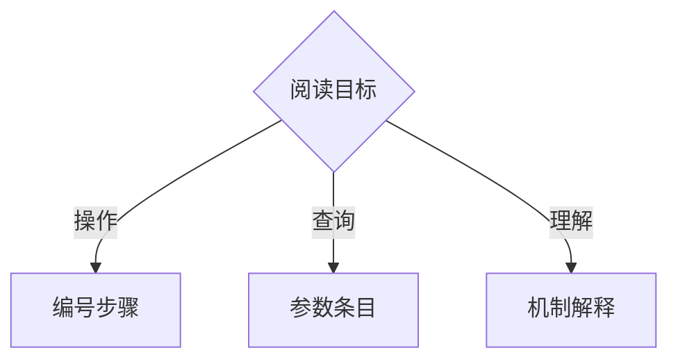
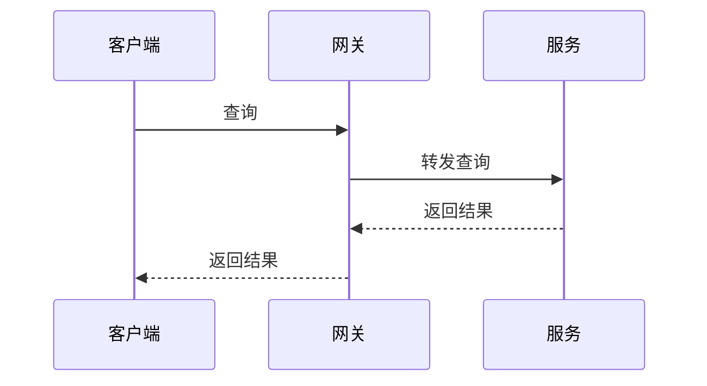

### 5.8 结构化表达规范

按真实关系选择表达：必要论证用短段，并列分条、顺序编号、分类嵌套、对应用表格，流程、交互和结构按需用图。不允许连续多段纯散文；插标题、逐段套列表或搬入表格不算修正。删重复，不删事实、原因、依据和限制；动作步骤以祈使动词开头。

#### 5.8.1 表达形式选择矩阵

根据信息类型选择最合适的表达形式：

| 信息类型 | 推荐形式 | 不推荐形式 | 判断依据 |
|---------|---------|-----------|---------|
| 多选项并列比较（≥2 维度） | 表格 | 散文逐条描述 | 表格让维度对齐可比，散文需要读者自己对齐 |
| 有依赖的动作 | 编号步骤或阶段 | 连续散文 | 命令、条件、验证与失败处理放在对应步骤内 |
| 并列要求/特征/职责/故障/阅读入口 | 分组条目 | 连续散文 | 分类编号用于定位，不表示执行顺序 |
| 分支流程/场景交互 | flowchart / sequence | 连续散文 | 前者展示分支，后者展示一次场景的交互顺序 |
| 状态转换 | Mermaid state diagram | 表格 | 状态机的转换条件用图比表格清晰 |
| 数据模型/实体关系 | Mermaid ER diagram | 散文 | 实体间的关系用图一目了然 |
| 时间线/里程碑 | Mermaid gantt / timeline | 散文列表 | 时间维度用图比文字直观 |
| 系统边界/组件职责与依赖 | Mermaid 结构关系图，可用基础 flowchart 表达 C4 视图 | 仅列目录树、步骤图或混画层次 | 架构说明须回答组成、职责、边界与依赖；简单关系可一句说清时不硬画，不强制 C4 四层，容器不等于 Docker 容器 |
| 静态调用关系 | 调用图 | 写成必经执行路径 | 表示函数可能调用谁，不代表每次都会调用 |
| 故障中的嵌套调用 | 真实调用栈 | 用源码推演冒充现场 | 对应实际故障记录 |
| 目录/文件净变化 | 等宽文件树 | 大段路径叙述 | 注明范围、比较版本、增删改与重命名；删除标记不表示已删本地文件 |
| 单一概念的解释 | 必要短段，分类与关系按需结构化 | 连续多段纯散文、逐段套列表 | 保留上下文，分类必须有真实依据 |
| 因果论证/取舍分析 | 短段论证，按关系配比较表或图 | 连续多段纯散文、用图表替代理由 | 前提、推理与结论相连，图表展示关系或差异 |
| 映射/参数/契约 | 表格或条目 | 长段落 | 按固定字段查询 |
| 单个关键数字或结论 | 加粗内联 | 独立表格 | 一个数字不需要表格包裹 |

按实际依赖拆动作，不按动词数量拆句；保留对应步骤的权限、备份、等待和失败停止条件。

#### 5.8.2 Mermaid 图使用规范

**适用场景**（用图比用文字更清晰的场景）：

| 场景 | 推荐图类型 | 示例 |
|------|-----------|------|
| 场景交互 / 服务通信 | sequence diagram | 标明设计流程或实际记录，只画声明场景 |
| 系统架构总览 | block diagram / flowchart | 组件间的依赖和数据流向 |
| 状态机 / 生命周期 | state diagram | 订单状态从创建到完成的所有转换 |
| 决策流程 | flowchart | 请求路由的分支判断逻辑 |
| 数据库设计 | ER diagram | 表间关系和外键 |
| 部署时间线 | gantt | 分阶段上线计划 |

**图的约束**：

- 信息量按读者问题决定；关系拥挤或层次混杂时拆分，不按列表项数限制
- 标题对应本节问题；架构图展示所需组成、职责、边界与依赖，不能用目录树或步骤图替代；其他图按所选图种表达流程、交互、状态等关系
- 图中模型、工具、文件资源等按真实项目关系绘制，不套成不存在的服务系统；图文名称、方向一致，按需补图例与题注
- 文字补充依据、取舍或限制，不逐箭头复述
- 复杂系统按读者需要从总览展开细节

默认使用发布端支持的基础语法。`architecture-beta` 仅在用途合适且渲染器支持时使用；基础门槛 11.1.0 不代表支持全部后续功能。交付前实际渲染，核对关系、标签与可读性是否回答本节问题，不只查图存在；未能渲染则明确未验证。

**画后优化与渲染委托**：图稿完成后，将同一文档的 Mermaid 图交给一个 fresh subagent 做排版优化、实际渲染和视觉检查。主模型负责图的含义及与正文的一致性，不重复读取参考网页、渲染图片和完整工具日志。

- 传入目标文件、图要回答的问题、必要的相邻正文、允许修改的图块，以及实际包根下的完整 §3、当前类型模板和本节路径。用户指定的参考资料由 subagent 阅读，只返回采纳要点；外部参考不是运行依赖。
- subagent 优化方向、分组、节点层级、标签换行、间距和线条，保留组件、边界、关系方向及条件。只改图块和必要图注；涉及含义变化时交回主模型判断，不为美观删减信息。
- 使用已有渲染工具逐图渲染并自行查看图片，修正拥挤、遮挡、文字截断和图文命名问题，再复验受影响图。颜色用于区分类别或强调职责，不代替文字与关系标注。
- 只返回文件位置、改动摘要、渲染工具及结果、视觉检查结论、语义变化和未验证项。主模型根据简报与图文差异复核；仅在有歧义或检查证据不足时查看具体图片。
- subagent 不可用时由主模型执行同一检查；渲染工具或权限不可用时明确未完成项，不自动安装或绕过权限。此步骤属于图稿优化，不代替独立读者测试。

布局可参考 [Mermaid Graph 实战指南](https://www.cnblogs.com/lvlin241/p/19940259)：流程关系优先尝试 LR，分层结构优先尝试 TB，子图表达真实分组。方向与线型以项目含义和实际渲染为准，这些建议不作为固定格式。

**不适用场景**（用图反而更不清晰）：

- 纯线性步骤（用编号列表更直接）
- 只有两个组件的简单关系（一句话说清楚）
- 只为缩短论证而画图，却未展示流程、交互或结构关系

**构造示意**：只展示排版与基础语法；图未渲染。

动作链用编号；独立信息用无序项：

```markdown
1. 选择文档变体。
2. 按该变体生成骨架。

- 目标读者：项目新成员
- 材料版本：指定提交
```

流程图表达分支：



时序图表达一次设计场景：



文件树表示假设版本 v1 → v2 的 `src/` 净变化；`+` 新增、`-` 删除、`~` 修改、`R` 重命名，未变文件省略：

```text
src/
├── + config.py
├── ~ app.py
├── - legacy.py
└── R util.py → utils.py
```

`git diff-tree` 提供差异，不直接生成文件树。

#### 5.8.3 表格使用规范

**适用场景**：信息有 ≥2 个维度需要并列比较时。

**格式要求**：

- 每列必须有明确的表头
- 单元格内容不超过 2 句话。超过则说明该内容不适合放在表格里
- 同一列内的内容保持并列关系（不混合数字和描述性文字）
- 标题和表头不足以说明用途时，表前补一句说明

**表格类型**：

| 类型 | 用途 | 示例 |
|------|------|------|
| 比较表 | 多方案横向对比 | 方案 A/B/C 在性能/成本/复杂度维度的对比 |
| 规格表 | 参数/配置项列举 | API 字段的名称、类型、是否必填、说明 |
| 映射表 | 概念间的对应关系 | 原始规则 → 约束编号的映射 |
| 状态表 | 条件与结果的对应 | HTTP 状态码与错误处理方式的映射 |

#### 5.8.4 标题层级与编号规范

**层级规则**：

- 最多使用 4 级标题（H1-H4）。超过 4 级说明文档结构需要重新组织
- 子标题不能自解释时（如"3.2 其他"），标题后加一句引导文字再接子标题。子标题已足够清晰时不强制加引导句
- 标题遵循 C1 的信息密度要求——必须准确描述该章节内容，不空泛

**编号规则**：

- 顶层章节使用数字编号（1. 2. 3.）
- 子章节使用层级编号（1.1 1.2 2.1）
- 列表项内部再嵌套时使用字母（a. b. c.）或无序列表，不再使用数字（避免与章节编号混淆）

#### 5.8.5 代码块使用规范

- 代码块用于展示实际代码片段、命令行示例、配置文件示例、事实卡片格式等结构化模板
- 必须标注语言类型（```python / ```yaml / ```json / ```markdown）
- 实际代码核对来源；构造示意标明只教语法或排版
- 按理解需要拆分，不截断语法或必要条件；注释符合语言语法

> 5.8.6 已合并到收尾检查清单（3.5）第 11 项，不再单独列出。

#### 5.8.7 符号与标注约定

普通词语和术语不加装饰性引号、反引号或方括号。保留真实引用、路径、命令、代码及必要 Markdown 结构；G1 规则源的模式定界引号和解析结构也须保留，不机械替换全文符号。

##### 义务、证据与状态

用简短陈述或状态列说明，不强制审计标签外形，不重复标记。

| 内容 | 表达要求 |
|------|---------|
| 义务强度（参考 RFC 2119） | 必须表示绝对要求，应该表示强烈建议且说明偏离条件，可以表示可选，禁止表示不可执行；仅在需要区分义务时使用 |
| 实测与经验数据 | 按 G2 说明来源、时间；估算说明推导依据，判断说明推理依据，假设说明成立条件和失效后果 |
| 待验证或待实现确认 | 说明缺口、验证方式及已约定时间，或依赖的实现与确认条件；时间未定如实说明 |
| 目标、契约与标识符 | 目标和契约值说明性质；版本号、错误码、日期、编号免于逐数字标注 |
| 完成度 | 按实际状态写已完成、进行中、待开始、已阻塞或已取消；已完成须有验证依据，阻塞或取消说明原因 |

##### 关系符号

用于流程描述、架构说明中表达元素间的关系。

| 符号 | 语义 | 使用场景 |
|------|------|---------|
| `→` | 顺序/因果/数据流向 | "请求 → 网关 → 服务" |
| `←→` | 双向交互 | "前端 ←→ WebSocket 服务" |
| `\|` | 并行/独立 | "服务 A \| 服务 B（独立部署）" |
| `⊃` | 包含/归属 | "平台 ⊃ {认证模块, 权限模块}" |

仅在行内简述结构关系时使用。复杂流程用 Mermaid 图（5.8.2），不用符号堆砌。

##### 引用格式

| 引用对象 | 格式 | 示例 |
|---------|------|------|
| 本文档章节 | `§{编号}` 或 `见 {节名}` | "见 §3.2" "详见 取舍说明 一节" |
| 外部文件 | `见 {文件路径}` | "见 `docs/api-spec.md`" |
| 代码符号 | 反引号包裹 | "`getUserById()`" |
| 约束编号 | 直接引用 | "违反了 C3 判断义务" |

##### 列表约定

| 情况 | 使用 | 原因 |
|------|------|------|
| 有先后顺序的步骤 | 编号列表 `1. 2. 3.` | 编号显式表达顺序 |
| 无顺序的并列项 | 无序列表 `- - -` | 无序避免暗示不存在的优先级 |
| 有优先级的并列项 | 编号列表 + 显式标注优先级 | 编号可用于引用，优先级在内容中说明 |
| 列表项内嵌套 | 字母编号 `a. b. c.` 或无序 | 避免数字嵌套数字造成混淆 |
| 列表不易扫描 | 按主题分组或转为表格 | 以查找需要决定，不按条数强拆 |

##### 嵌入约定

| 嵌入类型 | 格式 | 规则 |
|---------|------|------|
| 代码片段 | ` ```语言 ` 代码块 | 标注语言，保留完整语法与条件 |
| 图表 | ` ```mermaid ` 代码块 | 遵循 5.8.2 规范 |
| 引用定义 | `> ` 引用块 | 用于术语定义、关键引用 |
| 注意事项 | `> **注意**：` | 读者可能忽略但影响正确性的信息 |
| 警告 | `> **警告**：` | 可能导致数据丢失或安全问题的操作 |
| 表格 | Markdown 表格 | 遵循 5.8.3 规范，按需补引导句 |
