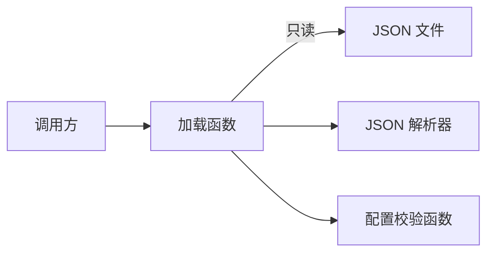

# 构造示意：只读配置加载

本例自行编写，仅演示结构、文件落点、契约和行为的对应；不是项目事实或真实来源。路径均拟议，伪代码未运行；Mermaid 已于 2026-09-18 使用本机现有渲染器生成并核对结构、箭头与标签。

## 目标与结构

假设需求：读取 UTF-8 JSON 配置，校验服务地址与重试次数后返回配置；失败返回可区分的错误。不修改文件、不实现热加载，不添加日志中继或状态库。



加载函数负责读、解析和校验的顺序；文件保存原始配置，解析器负责 JSON 语法，校验函数负责字段约束。各职责可由现有标准库和普通函数完成，无需新增服务。

## 拟议文件差异

基线：假设已有 `src/app.py`，尚无加载函数。`+` 新增、`~` 修改；未变文件省略，本树不是 Git 实际结果。

```text
src/
├── ~ app.py             调用加载函数并处理错误
└── + config.py          类型、加载与字段校验
tests/
└── + test_config.py     正常与失败用例
```

## 契约与行为

| 对象 | 拟议契约 |
|---|---|
| `Config` | `endpoint` 为有主机名的 HTTPS URL；`max_attempts` 为 1–5 的整数，布尔值无效；其他字段忽略 |
| `load_config(path)` | 返回 `Result[Config, ConfigError]`；只读，不重试；错误为 `Missing`、`ReadError` 或 `Invalid` |
| `validate_config(value)` | 输入必须为对象且含上述必需字段；检查字段类型与值域，返回配置或注明字段的 `Invalid` |

拟议同步调用链：`load_config` → 文件读取 → JSON 解析 → `validate_config`。失败结束本次调用；这不是运行时调用栈。

| 当前步骤 | 条件 | 结果／下一步 |
|---|---|---|
| 读取 | 文件不存在／读或解码失败 | 返回 `Missing`／`ReadError` |
| 解析 | JSON 无效 | 返回 `Invalid` |
| 校验 | 字段不合法 | 返回 `Invalid` 并定位字段 |
| 校验 | 所有要求满足 | 返回 `Config` |

```text
# 伪代码：使用目标语言的文件上下文管理与错误类型
load_config(path: Path) -> Result[Config, ConfigError]:
    try:
        with open_utf8(path) as stream:
            text = stream.read()
    except FileNotFound:
        return Missing(path)
    except (IOError, DecodeError):
        return ReadError(path)

    # 离开读取块时已关闭文件；后续解析失败也不会泄漏句柄。
    try:
        value = parse_json(text)
    except JsonError:
        return Invalid("JSON")
    return validate_config(value)
```

代码沿用同一组领域名称；`validate_config` 的逐字段实现按上表契约补齐，例中不展开。注释解释清理时机，不逐行复述动作。

## 验证设计（未执行）

- 合法输入返回匹配字段；缺失文件、读失败、解码失败、非法 JSON 分别返回约定错误。
- 字段缺失、非 HTTPS、空主机、次数为布尔值或越界均返回 `Invalid`；以合法输入和已知非法输入核查判定器。
- 在目标语言的文件接口测试替身上检查正常、读取异常时均关闭已打开的句柄；另以临时文件验证真实接入。

以上是计划，不填通过率或性能数据。执行测试与目标项目修改另行授权。
